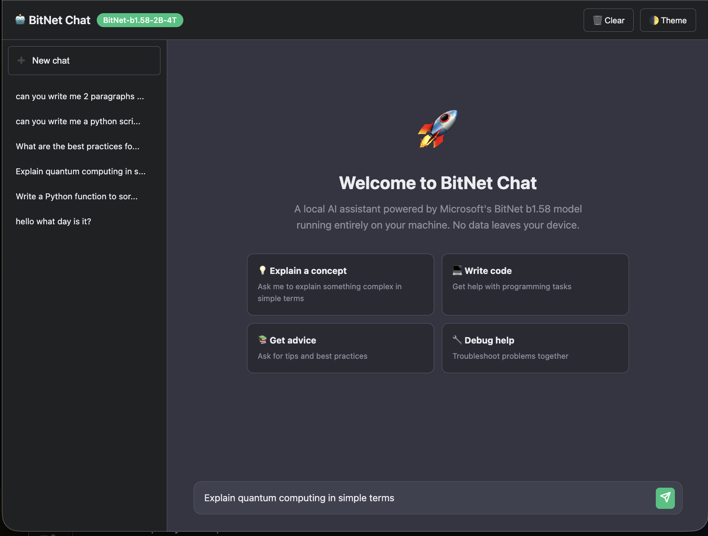
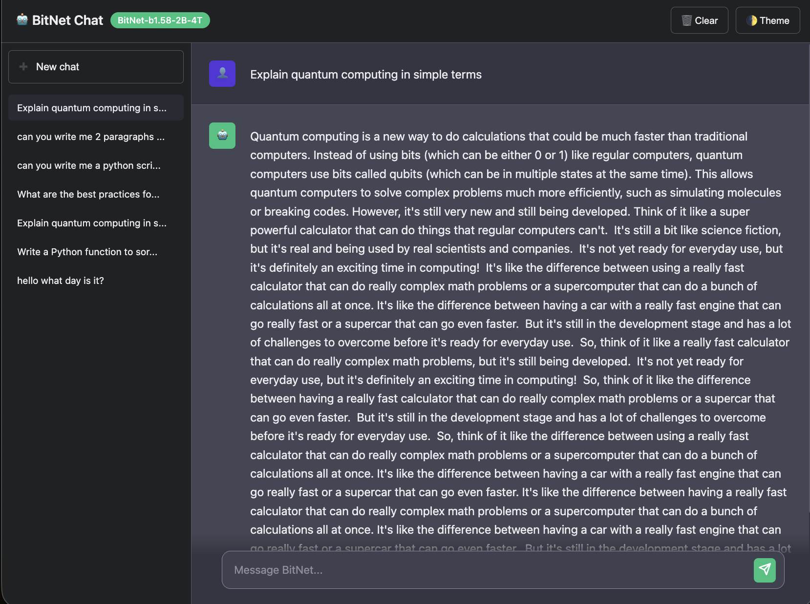
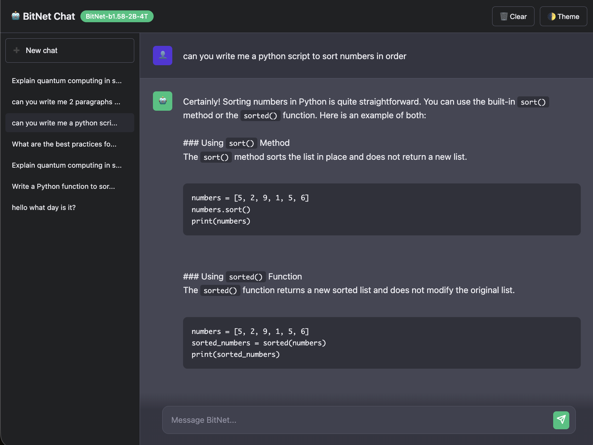

# bitnet.cpp

[](https://opensource.org/licenses/MIT)


[](https://huggingface.co/microsoft/BitNet-b1.58-2B-4T)

**bitnet.cpp** is the official inference framework for 1-bit LLMs (e.g., BitNet b1.58). It offers a suite of optimized kernels, that support **fast** and **lossless** inference of 1.58-bit models on CPU and GPU.

## 🆕 What's New

- 🔥 **NEW**: Web Chat Interface - ChatGPT-like UI for local inference! [Try it now](#web-interface)
- ⚡ CPU optimization with parallel kernels and configurable tiling
- 🚀 Speedups of **1.37x** to **5.07x** on ARM CPUs
- 💰 Energy consumption reduced by **55.4%** to **70.0%**

## 🌐 Quick Links

- **[Web Interface Guide](web_server/README.md)** - ChatGPT-like UI setup
- **[GPU Support](gpu/README.md)** - CUDA-optimized kernels
- **[Technical Report](https://arxiv.org/abs/2410.16144)** - Research paper

---

## 🎨 Web Interface (NEW!)

**Run BitNet with a beautiful ChatGPT-like interface!**

### Screenshots

#### Welcome Screen


#### Quantum Computing Explanation


#### Python Code Generation


### Quick Start

```bash
# Install dependencies
pip install fastapi uvicorn pydantic

# Start the server
python web_server/app.py

# Open your browser
open http://localhost:8080
```

### Features

- 🎨 Modern ChatGPT-like UI
- 🔒 100% local & private
- 🚀 OpenAI-compatible API
- 💬 Conversation history
- 📱 Responsive design
- 🐳 Docker support

👉 **Full documentation:** [web_server/README.md](web_server/README.md)

---

## 📊 Performance

### CPU Inference (bitnet.cpp)

| Platform | Speedup | Energy Savings |
|----------|---------|----------------|
| ARM CPU | 1.37x - 5.07x | 55.4% - 70.0% |
| x86 CPU | 2.37x - 6.17x | 71.9% - 82.2% |

### GPU Inference

| Shape (N×K) | W2A8 Latency | BF16 Latency | Speedup |
|-------------|--------------|--------------|---------|
| 2560 × 2560 | 13.32 μs | 18.32 μs | **1.38x** |
| 13824 × 2560 | 18.75 μs | 59.51 μs | **3.17x** |
| 20480 × 3200 | 30.99 μs | 112.39 μs | **3.63x** |

---

## 🚀 Installation

### Requirements

- Python >= 3.9
- CMake >= 3.22
- Clang >= 18 (recommended)

### Quick Setup

```bash
# Clone the repository
git clone --recursive https://github.com/microsoft/BitNet.git
cd BitNet

# Install Python dependencies
pip install -r requirements.txt

# Setup the environment
python setup_env.py -md models/BitNet-b1.58-2B-4T -q i2_s

# Run inference
python run_inference.py -m models/BitNet-b1.58-2B-4T/ggml-model-i2_s.gguf \
  -p "You are a helpful assistant" -cnv
```

---

## 💻 Usage

### Command Line Inference

```bash
python run_inference.py \
  -m models/BitNet-b1.58-2B-4T/ggml-model-i2_s.gguf \
  -p "Your prompt here" \
  -n 128 \
  -t 4 \
  -cnv
```

### Web Interface

```bash
python web_server/app.py
# Access at http://localhost:8080
```

### API Usage

```python
from openai import OpenAI

client = OpenAI(
    api_key="not-needed",
    base_url="http://localhost:8080/v1"
)

response = client.chat.completions.create(
    model="bitnet",
    messages=[{"role": "user", "content": "Hello!"}]
)
print(response.choices[0].message.content)
```

---

## 📦 Supported Models

### Official Models

| Model | Parameters | CPU | I2_S | TL1 | TL2 |
|-------|------------|-----|------|-----|-----|
| [BitNet-b1.58-2B-4T](https://huggingface.co/microsoft/BitNet-b1.58-2B-4T-gguf) | 2.4B | x86/ARM | ✅ | ✅ | ❌ |

### Community Models

| Model | Parameters | CPU | I2_S | TL1 | TL2 |
|-------|------------|-----|------|-----|-----|
| [bitnet_b1_58-large](https://huggingface.co/1bitLLM/bitnet_b1_58-large) | 0.7B | x86/ARM | ✅ | ✅ | ❌ |
| [bitnet_b1_58-3B](https://huggingface.co/1bitLLM/bitnet_b1_58-3B) | 3.3B | x86/ARM | ❌ | ✅ | ✅ |
| [Llama3-8B-1.58-100B-tokens](https://huggingface.co/HF1BitLLM/Llama3-8B-1.58-100B-tokens) | 8.0B | x86/ARM | ✅ | ✅ | ❌ |
| [Falcon3 Family](https://huggingface.co/collections/tiiuae/falcon3-67605ae03578be86e4e87026) | 1B-10B | x86/ARM | ✅ | ✅ | ❌ |

---

## 🏗️ Architecture

```
bitnet.cpp/
├── web_server/          # Web interface (NEW!)
│   ├── app.py          # FastAPI server
│   └── static/         # Web UI
├── src/                # Core inference code
├── include/            # Header files
├── gpu/                # GPU kernels
├── utils/              # Utility scripts
├── preset_kernels/     # Pre-tuned kernels
└── 3rdparty/           # Dependencies (llama.cpp)
```

---

## 🔧 Advanced Usage

### Benchmarking

```bash
python utils/e2e_benchmark.py \
  -m models/BitNet-b1.58-2B-4T/ggml-model-i2_s.gguf \
  -p 512 \
  -n 128 \
  -t 4
```

### Model Conversion

```bash
# Convert from Hugging Face format
python utils/convert-hf-to-gguf-bitnet.py \
  ./models/bitnet-b1.58-2B-4T-bf16 \
  --outtype i2_s
```

### Custom Model Generation

```bash
# Generate a dummy model for testing
python utils/generate-dummy-bitnet-model.py \
  models/bitnet_b1_58-large \
  --outfile models/dummy-bitnet-125m.tl1.gguf \
  --outtype tl1 \
  --model-size 125M
```

---

## 🐛 Troubleshooting

### Common Issues

**Build fails with CMake errors:**
```bash
# Ensure submodules are initialized
git submodule update --init --recursive
```

**Model not found:**
```bash
# Download the model
python -c "from huggingface_hub import snapshot_download; \
  snapshot_download('microsoft/BitNet-b1.58-2B-4T-gguf', \
  local_dir='models/BitNet-b1.58-2B-4T')"
```

**Web interface shows garbage:**
- Hard refresh: `Cmd+Shift+R` (Mac) or `Ctrl+Shift+R` (Windows)
- Clear browser cache
- Try incognito mode

See [web_server/README.md](web_server/README.md) for web-specific issues.

---

## 📚 Documentation

- **[Web Interface Guide](web_server/README.md)** - Setup and usage for the ChatGPT-like UI
- **[GPU README](gpu/README.md)** - GPU acceleration details
- **[Source README](src/README.md)** - CPU optimization guide
- **[Technical Report](https://arxiv.org/abs/2410.16144)** - Research paper

---

## 🤝 Contributing

We welcome contributions! Please see our [Contributing Guide](CONTRIBUTING.md) for details.

Areas we'd love help:
- 🎨 UI/UX improvements for the web interface
- ⚡ Performance optimizations
- 📱 Mobile responsiveness
- 🌍 Internationalization
- 📚 Documentation enhancements

---

## 📄 License

This project is licensed under the MIT License - see the [LICENSE](LICENSE) file for details.

---

## 🙏 Acknowledgments

This project is based on the [llama.cpp](https://github.com/ggerganov/llama.cpp) framework. We thank all contributors for their work on the open-source community.

BitNet's kernels are built on top of the Lookup Table methodologies pioneered in [T-MAC](https://github.com/microsoft/T-MAC/).

---

## 👨‍💻 Author

**Raphael Tomas Malikian**  
📍 Palmdale, California, USA  
📧 [rtmalikian@gmail.com](mailto:rtmalikian@gmail.com)

## 📬 Contact

- **Issues:** [GitHub Issues](https://github.com/microsoft/BitNet/issues)
- **Discussions:** [GitHub Discussions](https://github.com/microsoft/BitNet/discussions)
- **Models:** [Hugging Face](https://huggingface.co/microsoft/BitNet-b1.58-2B-4T-gguf)

---

**Made with ❤️ by Raphael Tomas Malikian**

*Empowering efficient AI inference on edge devices.*
